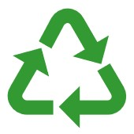
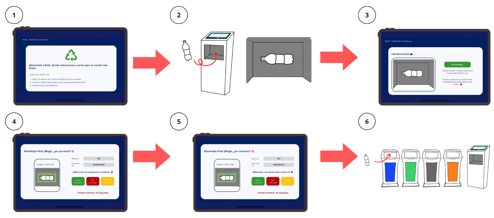

# 🌱 BinIt! - Clasificador Inteligente de Residuos

<div align="center">
  
  
  **🌍 Cada escaneo cuenta para un mundo más limpio**
  
  [](https://python.org)
  [](https://tensorflow.org)
  [](https://flask.palletsprojects.com)
  [](https://keras.io)
</div>

## 📖 Descripción

BinIt! es un sistema inteligente de clasificación de residuos que utiliza inteligencia artificial para promover el cuidado ambiental mediante la correcta separación de basura. El sistema combina hardware y software para proporcionar una solución completa y fácil de usar.

### 🎯 Características Principales

- **🤖 IA Avanzada**: Modelo basado en EfficientNetB3 entrenado con dataset personalizado
- **📱 Interfaz Web Intuitiva**: Panel de control fácil de usar con instrucciones claras
- **🔍 Análisis Visual**: Implementación de Grad-CAM para explicabilidad del modelo
- **⚡ Tiempo Real**: Detección automática y procesamiento instantáneo
- **🔧 Flexible**: Compatible con Raspberry Pi 5 y otros microcontroladores
- **🌐 Accesible**: Servidor web local para múltiples usuarios
- **🔄 Re-entrenamiento**: El sistema aprende de correcciones del usuario

## ♻️ Cómo Usar BinIt!

### Paso a Paso

1. **🔴 Inicio**: La aplicación iniciará la cámara automáticamente
2. **📍 Colocación**: Coloca el residuo en la zona de detección marcada
3. **⏳ Detección**: Mantén el objeto quieto para mejor precisión
4. **🧠 Análisis**: El modelo procesará la imagen automáticamente
5. **📊 Resultado**: Verifica la clasificación y contenedor sugerido
6. **✅ Confirmación**: Confirma si es correcto o proporciona feedback

<div align="center">
  
</div>

## 🗂️ Categorías de Residuos Detectadas

| Categoría      | Descripción            | Contenedor |
| -------------- | ---------------------- | ---------- |
| 📦 CARDBOARD   | Cartón y cajas         | Reciclable |
| 🪟 GLASS       | Vidrio y cristal       | Reciclable |
| 🔩 METAL       | Metales diversos       | Reciclable |
| 🍃 ORGANIC     | Residuos orgánicos     | Compost    |
| 📄 PAPER       | Papel y documentos     | Reciclable |
| ✏️ PEN         | Bolígrafos y plumas    | Especial   |
| 🍶 PET         | Botellas plásticas     | Reciclable |
| 🛍️ PLASTIC_BAG | Bolsas plásticas       | Especial   |
| 📦 UNICEL      | Poliestireno expandido | Especial   |
| 🍫 WRAPPER     | Envolturas y empaques  | Inorgánico |
| ❓ OTHER       | Otros residuos         | Inorgánico |

## 🚀 Instalación y Configuración

### Requisitos Previos

- Python 3.8 o superior
- Raspberry Pi 5 (recomendado) o servidor con GPU
- Cámara web o módulo de cámara
- Pantalla táctil (opcional)

### 1. Clonar el Repositorio

```bash
git clone https://github.com/OnlyAlec/BinIt-AI.git
cd binit_ai
```

### 2. Crear Entorno Virtual

```bash
python3 -m venv venv
source venv/bin/activate  # En Windows: venv\Scripts\activate
```

### 3. Instalar Dependencias

```bash
pip install -r requirements.txt
```

### 4. Ejecutar la Aplicación

```bash
python app.py
```

### 5. Acceder a la Interfaz


Abre tu navegador y ve a: `http://localhost:5000` o `http://[IP-de-tu-dispositivo]:5000`

## 🧠 Tecnologías Utilizadas

### Backend

- **Flask**: Framework web ligero y eficiente
- **TensorFlow/Keras**: Para inferencia del modelo de IA
- **OpenCV**: Procesamiento de imágenes y Grad-CAM
- **Pillow**: Manipulación de imágenes
- **NumPy**: Operaciones numéricas optimizadas

### Frontend

- **HTML5**: Estructura semántica moderna
- **CSS3**: Diseño responsive y animaciones
- **JavaScript (Vanilla)**: Interactividad sin dependencias

### Modelo de IA

- **Arquitectura**: EfficientNetB3 pre-entrenado
- **Transfer Learning**: Adaptado para clasificación de residuos
- **Explicabilidad**: Implementación de Grad-CAM
- **Optimización**: Configurado para edge computing

## 📊 Estructura del Proyecto

```
binit_ai/
├── 📜 main.py                   # Servidor Flask principal
├── 🧠 model.h5                  # Modelo entrenado
├── 📋 requirements.txt          # Dependencias
├── 📁 static/
│   ├── 🎨 css/style.css        # Estilos
│   ├── 🖼️ images/              # Recursos gráficos
│   └── ⚡ js/scripts.js        # Lógica frontend
├── 📁 templates/
│   └── 🌐 index.html           # Interfaz principal
└── 📁 training_data/           # Dataset para reentrenamiento
    ├── 📦 CARDBOARD/
    ├── 🔩 METAL/
    ├── 📄 PAPER/
    └── 🍶 PET/
```

## 🌍 Impacto Ambiental

### Beneficios

- **♻️ Mejora del Reciclaje**: Clasificación precisa aumenta tasas de reciclaje
- **📚 Educación**: Enseña a usuarios sobre gestión de residuos
- **📈 Datos**: Recopila estadísticas para optimizar gestión de basura
- **🌱 Sostenibilidad**: Promueve hábitos ecológicos responsables

## 📄 Licencia

Este proyecto está bajo la Licencia MIT. Ver `LICENSE` para más detalles.

## 👥 Equipo

Desarrollado con ❤️ para un mundo más sostenible:

**👩‍💻 [@EliBece](https://github.com/EliBece)** |
**👩‍💻 [@SofiBecerril](https://github.com/SofiBecerril)** |
**👨‍💻 [@omarrdbz](https://github.com/omarrdbz)** |
**👨‍💻 [@onlyalec](https://github.com/onlyalec)**

---

<div align="center">
  <strong>🌱 BinIt! - Haciendo la diferencia, un residuo a la vez</strong>
  <br>
  <sub>Construido con inteligencia artificial para un futuro sostenible</sub>
</div>
